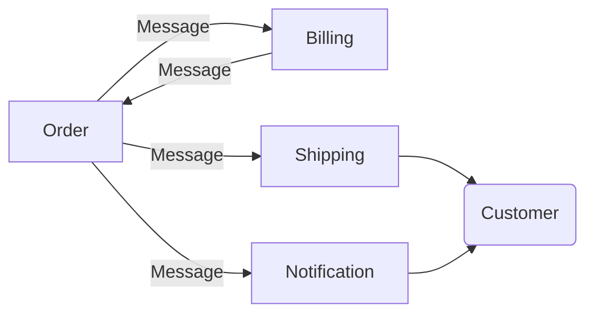

## Loosely-coupled Micro-services Architecture on K8S

This is a simple demo to demonstrate how to develop loosely-coupled Micro-services on Kubernetes using Distributed Application Runtime (DAPR).

For this demo I have an order service which will simulate a creation of a new order and publish an order placed event.
On the other side there is the subscriber which is the notification service.

Order service is exposed on port 8080
Notification service is NOT exposed

Whenever a new order comes in, the notification service will pick up that published message and send an email to the customer informing them about their order.
Of course this is just a simulation, so there is no real email sending.

The cool thing about DAPR is that it's Cloud Agnostic and it's an open-source tool.

First I'll create a Kubernetes cluster with 3 namespaces - development, staging and production:

```sh
k3d cluster create \
    --registry-create default-registry:0.0.0.0:5432 \
    --volume ${PWD}/order:/apps/order@server:0 \
    --volume ${PWD}/notification:/apps/notification@server:0 \
    --volume ${PWD}/shipping:/apps/shipping@server:0 \
    --volume ${PWD}/billing:/apps/billing@server:0
```

Let's create the different namespaces for each environment:

```sh
kubectl create namespace development && \
kubectl create namespace staging && \
kubectl create namespace production
```

Then I'll go on and install DAPR in it's own namespace inside of the cluster:

```sh
helm repo add dapr https://dapr.github.io/helm-charts
helm repo update
helm install \
    dapr dapr/dapr \
    --namespace dapr-system \
    --create-namespace \
    --wait
kubectl --namespace dapr-system get all
```

For the statestore and pubsub components we need a database, we'll use redis for all environments(this could be easily changed later), let's deploy it:

```sh
helm repo add bitnami https://charts.bitnami.com/bitnami
helm repo update
for env in $(echo development staging production | xargs); \
do \
helm install \
    redis bitnami/redis \
    --namespace $env; \
done
```

Let's wait for the deployments of redis to finish:

```sh
kubectl --namespace development rollout status statefulsets.apps redis-master && \
kubectl --namespace staging rollout status statefulsets.apps redis-master && \
kubectl --namespace production rollout status statefulsets.apps redis-master
```

And let's deploy the components for each environment(for the sake of simplicity I left all components the same, but it will be possible to change them later without touching any application code):

```sh
for env in $(echo development staging production | xargs); \
do \
    echo "==> Deploying DAPR components and CRD's in namespace $env"; \
    kubectl apply -k infrastructure/environments/$env/; \
done
```

If you inspect the directory **infrastructure/base**, you'll find there are components and CRD's of dapr that will tell the application where to store the state and a description of what services subscribe to what messages and on what endpoint are they expecting to receive them.

To deploy the different demo services we can run:

```sh
make build_services
make deploy_services
```

The Architecture overview of the messaging-flow is as follows:



For the observability part let's deploy Zipkin, it's a tool that will help us to detect on which service we have a bottle neck.
(Note that we deployed configuration for zipkin tracing beforehand, if you don't need tracing you can remove this config file)

```sh
kubectl create namespace tracing
kubectl --namespace tracing create deployment zipkin --image=openzipkin/zipkin
kubectl --namespace tracing expose deployment zipkin --type ClusterIP --port 9411
kubectl --namespace tracing rollout status deployment zipkin
kubectl --namespace tracing get all
```

All we need to do in order to enable tracing on the particular deployments is add the annotations(already enabled, if you don't want tracing simply remove this annotation and redeploy):

```yaml
dapr.io/config: "tracing"
```
